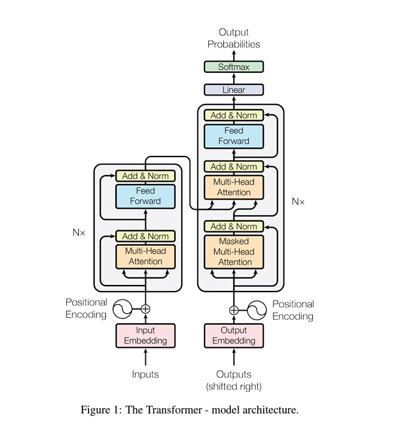

# Transformers-Encoder-and-Decoder
Language translation encoder and decoder using Transformers

# Reference paper : 
"**Attention Is All You Need**"
https://arxiv.org/abs/1706.03762

# Architecture :

# Main components
1. [**Positional Embedding**](/Transformer/com/iqvia/Positional_Embedding.py)
2. [**Embedding Layer**](/Transformer/com/iqvia/Embeddings.py)
3. [**Transformer Encoding**](/Transformer/com/iqvia/TransformerEncoder.py)
4. [**Transformer Decoding**](/Transformer/com/iqvia/TransformerDecoder.py)
5. [**Transformer Model**](/Transformer/com/iqvia/TransformerModel.py)
   
